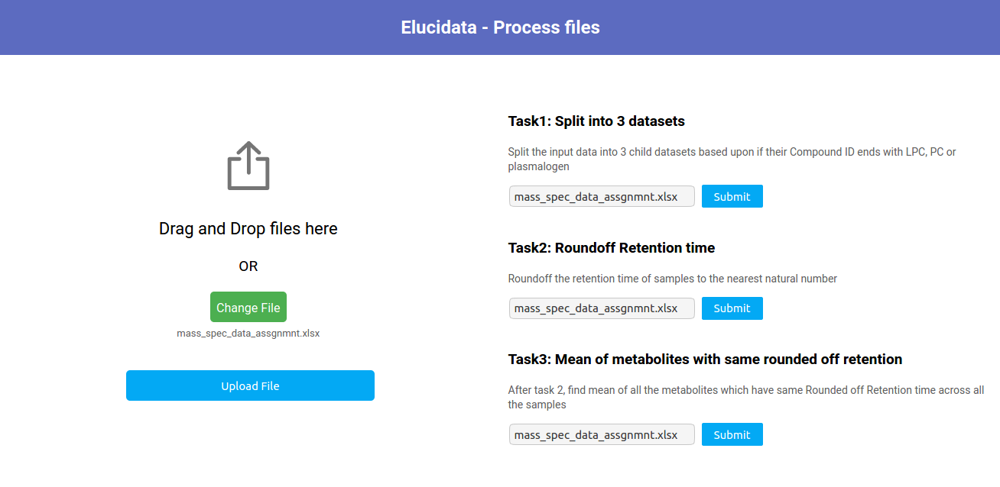
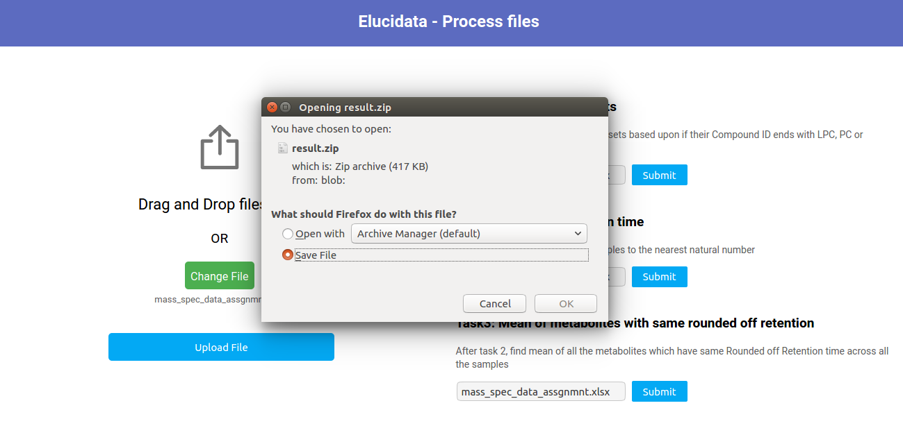

# File process - React APP

This web app facilitates user to upload .xlsx files and perform several queries on the uploaded file. The result of each query is provided to the client in a zip file. This project is created using [React](https://reactjs.org/) version 17.0.1

## Front End

## Steps to run the project

###### Clone the repo
`git clone https://github.com/gau1rav/Frontend-Process-files`

###### Move inside the cloned repo
`cd <path_to_repo>`

###### Install dependencies
`npm install`

###### Start the development server
`npm start`

Visit `http://localhost:3000` to view the app in browser

**Note: Please wait for a few seconds after clicking the submit button of each query/task. The server takes a few seconds to process the file and send the results back in zip format. To avoid spamming on server, buttons are disabled when a service(query) request is in progress*

**Note: User Id(used to create unique filename for each user in server) is hard coded as 001 in client side for now. However, it can be stored in a database and then accessed from there to ensure itegrity of user id*

## Learn More

You can learn more in the [Create React App documentation](https://facebook.github.io/create-react-app/docs/getting-started).

To learn React, check out the [React documentation](https://reactjs.org/).
